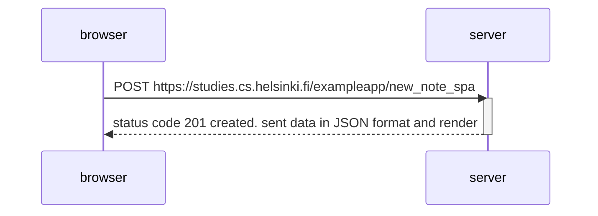

### This is a sequence diagram for the user creating a new note using the single-page version of the app

```mermaid
sequenceDiagram
    participant browser
    participant server

    browser->>server: POST https://studies.cs.helsinki.fi/exampleapp/new_note_spa
    activate server
    server-->>browser:  status code 201 created. sent data in JSON format and render
    deactivate server
```
